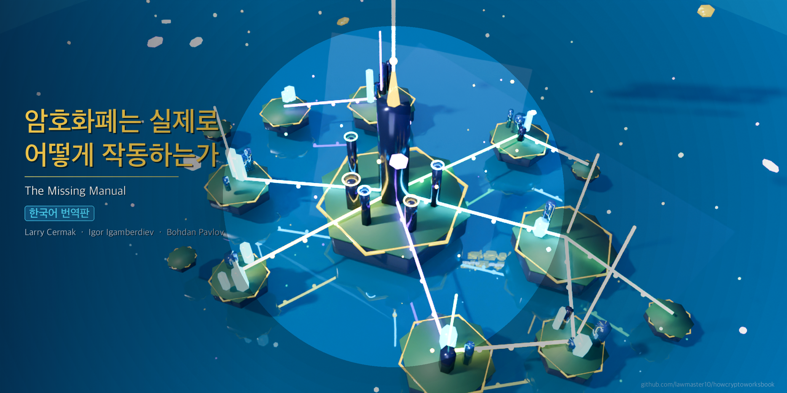

  

# 암호화폐는 실제로 어떻게 작동하는가: 빠진 매뉴얼

> **이 레포지토리는 [How Crypto Actually Works: The Missing Manual](https://github.com/lawmaster10/howcryptoworksbook)의 한국어 번역본입니다.**
>
> 원저자: **Larry Cermak** | 공동 저자: **Igor Igamberdiev** (Wintermute), **Bohdan Pavlov** (Wintermute)
>
> 리뷰어: Wintermute Research, The Block Research | 편집: Tim Copeland

---

**현재 상태:** 초판 출간 전 - 커뮤니티 피드백을 위한 공개 버전

---

## 이 책에 대하여

*암호화폐는 실제로 어떻게 작동하는가*는 비트코인의 UTXO 모델부터 양자 내성 암호학까지, 암호화폐가 실제로 어떻게 작동하는지를 설명하는 포괄적인 기술 서적입니다. 15개 챕터와 서문에 걸쳐 90,000단어 이상의 분량으로, 기초 개념부터 암호화폐 생태계의 최신 발전까지 모든 것을 다룹니다.

이 레포지토리에는 책의 전체 한국어 번역문이 포함되어 있으며, 오픈 소스로 무료로 읽고, 다운로드하고, 공유할 수 있습니다.

## 이 책이 존재하는 이유

암호화폐에 대한 견고한 기초를 제공할 수 있는 단일 자료를 추천하려 했을 때, 적절한 것을 찾기 어려웠습니다. 어떤 책은 하나의 프로토콜에만 깊이 파고들고 나머지를 무시합니다. YouTube와 X는 위장된 광고로 넘쳐납니다. 최고의 리서치는 수십 개의 유료 사이트에 흩어져 있습니다. 학술 논문은 엄밀하지만 실용적인 학습에는 너무 추상적입니다.

모든 것에 뭔가가 빠져 있었습니다: 너무 좁거나, 너무 편향되거나, 너무 고급이거나, 너무 파편화되거나, 가이드 없이는 접근하기가 너무 어려웠습니다.

이 책은 그 문제를 해결하기 위한 시도입니다.

## 이 책의 차별점

- **포괄적인 범위:** 비트코인, 이더리움, 솔라나, DeFi, MEV, 스테이블코인, 커스터디, 시장 구조, 거버넌스, NFT, DePIN, 양자 내성 등을 다루는 15개 챕터
- **최신 정보:** 암호화폐는 빠르게 변화하며 대부분의 책은 출판 전에 이미 구식이 됩니다. 이 책은 최신 데이터, 프로토콜, 시장 현실로 적극적으로 유지보수됩니다
- **체계적 학습:** 각 챕터는 이전 챕터를 기반으로 하여 점진적으로 복잡도가 증가하는 일관된 이야기를 만들어갑니다
- **전문가 리뷰:** 각 챕터는 해당 특정 분야에서 깊이 일하는 전문가가 검토했습니다
- **솔직한 평가:** 기술적 아이디어를 쉽게 설명하되 수준을 낮추지 않으며, 장점과 한계를 모두 논의합니다
- **오픈 소스:** 전체 책을 무료로 읽고 공유할 수 있습니다. 기본 교육은 유료 벽 뒤에 잠겨서는 안 됩니다

## 이 책의 대상 독자

이 책은 기술이 실제로 어떻게 작동하는지 이해하고 싶은 사람들을 위해 쓰여졌습니다. 단순히 트레이더나 투자자를 위한 것이 아닙니다. 지적 호기심을 가정하지만, 사전 전문 지식을 가정하지는 않습니다.

이 책을 주의 깊게 읽고 핵심 아이디어를 흡수한다면, 오늘날 암호화폐 업계에서 풀타임으로 일하는 대부분의 사람들보다 더 많은 것을 알게 될 것입니다.

## 목차

| # | 챕터 |
|---|------|
| - | [서문: 왜 이것이 중요한가](Chapters/_preface.md) |
| 1 | [비트코인에 대한 포괄적 소개](Chapters/ch01_bitcoin.md) |
| 2 | [이더리움 생태계](Chapters/ch02_ethereum.md) |
| 3 | [솔라나 생태계](Chapters/ch03_solana.md) |
| 4 | [L1 블록체인](Chapters/ch04_l1_blockchains.md) |
| 5 | [커스터디 기초](Chapters/ch05_custody.md) |
| 6 | [암호화폐 시장 구조 및 트레이딩](Chapters/ch06_market_structure.md) |
| 7 | [탈중앙화 금융(DeFi)](Chapters/ch07_defi.md) |
| 8 | [최대 추출 가능 가치(MEV)](Chapters/ch08_mev.md) |
| 9 | [스테이블코인과 실물자산(RWA)](Chapters/ch09_stablecoins_rwas.md) |
| 10 | [하이퍼리퀴드](Chapters/ch10_hyperliquid.md) |
| 11 | [대체 불가능 토큰(NFT)](Chapters/ch11_nfts.md) |
| 12 | [거버넌스 및 토큰 이코노믹스](Chapters/ch12_governance.md) |
| 13 | [탈중앙화 물리 인프라 네트워크(DePIN)](Chapters/ch13_depin.md) |
| 14 | [양자 내성](Chapters/ch14_quantum_resistance.md) |
| 15 | [예측 시장](Chapters/ch15_prediction_markets.md) |

[서문](Chapters/_preface.md)부터 시작하거나, [전체 목차](table_of_contents.md)에서 섹션별 상세 구성을 확인하세요.

## 기여하기

이 한국어 번역본의 개선에 기여하고 싶으시다면, [CONTRIBUTING.md](CONTRIBUTING.md)를 참조해 주세요.

오류를 발견하거나 의견이 있거나 개선사항을 기여하고 싶으시다면:

- **작은 수정:** 수정사항이 포함된 풀 리퀘스트를 제출해 주세요
- **큰 변경이나 새로운 자료:** 먼저 저자와 조율해 주세요
- **질문이나 토론:** 이슈를 열어주세요

---

## 원본 저작물

이 번역본의 원본은 Larry Cermak의 [How Crypto Actually Works: The Missing Manual](https://github.com/lawmaster10/howcryptoworksbook)입니다.

## 라이선스

원본 저작물은 <a rel="license" href="https://creativecommons.org/licenses/by-nc-nd/4.0/">크리에이티브 커먼즈 저작자표시-비영리-변경금지 4.0 국제 라이선스</a>로 라이선스가 부여되어 있습니다.

이 번역본은 교육 목적으로 원본을 한국어로 번역한 것이며, 원저자의 저작물에 대한 모든 권리는 원저자에게 있습니다.
